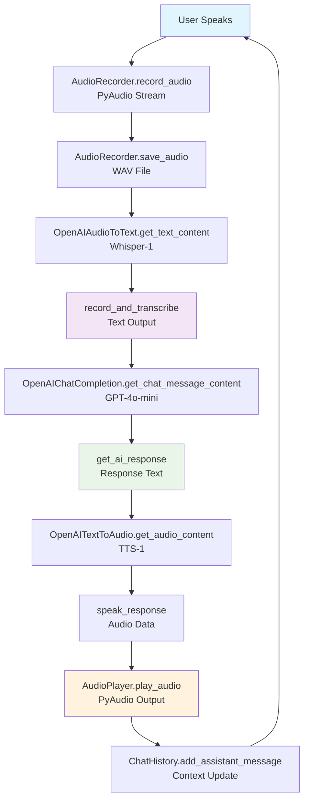

# Voice Agent Project

A complete voice agent built with Python and OpenAI that provides natural voice interaction with AI.

## 🎯 Features

- **Voice Input**: Record audio using your microphone (Enter key to start/stop)
- **Speech-to-Text**: Convert speech to text using OpenAI's Whisper
- **AI Chat**: Get intelligent responses using OpenAI's GPT models
- **Text-to-Speech**: Convert AI responses back to speech using OpenAI's TTS
- **Conversation History**: Maintains context across interactions

## 🤖 Multi-Modal AI Integration

This voice agent demonstrates **multi-modal AI capabilities** using Semantic Kernel:

- **Audio → Text**: Speech recognition via OpenAI Whisper
- **Text → Intelligence**: Natural language processing via GPT-4o-mini
- **Text → Audio**: Voice synthesis via OpenAI TTS
- **Context Preservation**: Seamless conversation flow across all modalities

The system uses Semantic Kernel's connector architecture to unify three different AI services into a single conversational experience.

## 🧠 State & Context Management

The voice agent maintains **conversation state and context** throughout the session using Semantic Kernel's `ChatHistory`:

### **Conversation Memory**

- **System Prompt**: Set once at initialization and maintained throughout the session
- **User Messages**: All transcribed speech inputs are stored in conversation history
- **Assistant Responses**: All AI-generated responses are added to the context
- **Multi-turn Context**: Previous interactions are passed to GPT for coherent conversations

### **State Lifecycle**

```
Session Start → ChatHistory Created → System Prompt Added
     ↓
User Speaks → Transcribed → Added to History → GPT Processes with Full Context
     ↓
AI Responds → Response Added to History → Context Grows
     ↓
Session Continues → All Previous Context Available
```

### **Context Example**

```
Turn 1: User: "What's the weather today?"
         AI: "It's sunny and 75°F today."

Turn 2: User: "Will it rain tomorrow?"
         AI: "Based on the forecast, tomorrow will be cloudy with a 30% chance of rain."

Turn 3: User: "Should I bring an umbrella?"
         AI: "Yes, I'd recommend bringing an umbrella since there's a chance of rain tomorrow."
```

**Notice**: The AI remembers previous weather discussions and can reference them!

### **State Limitations**

- **In-Memory Only**: Chat history is not persisted between sessions
- **Session-Based**: State is lost when the program restarts
- **Single User**: No multi-user conversation isolation
- **No Database**: No permanent storage of conversation history

### **Technical Implementation**

```python
# ChatHistory object stores all conversation context
self.history = ChatHistory()
self.history.add_system_message(self.system_prompt)

# Each interaction adds to the context
self.history.add_user_message(user_input)
response = await self.chat_service.get_chat_message_content(
    chat_history=self.history,  # Full context passed to GPT
    settings=OpenAIChatPromptExecutionSettings(...)
)
self.history.add_assistant_message(response.content)
```

## 🔄 Voice Agent Flow



## 📁 Project Structure

```
voice-agent/
├── voice_agent.py          # Voice agent (Enter-based)
├── test_setup.py           # Setup verification script
├── requirements.txt         # Python dependencies
├── .env                   # Environment configuration (OpenAI API key)
└── README.md              # This file
```

## 🚀 Quick Start

### Prerequisites

- Python 3.10 or higher
- OpenAI API key
- Microphone and speakers/headphones
- macOS (for keyboard input support)

### Installation

1. **Create a virtual environment**:

   ```bash
   python3 -m venv voice_agent_env
   source voice_agent_env/bin/activate
   ```

2. **Install dependencies**:

   ```bash
   pip install -r requirements.txt
   ```

3. **Install PortAudio** (required for PyAudio):

   ```bash
   brew install portaudio
   ```

4. **OpenAI API Key**:
   The voice agent uses the existing `.env` file for configuration.
   Make sure your `.env` file contains your OpenAI API key:
   ```
   OPENAI_API_KEY=your-openai-api-key-here
   ```

### Usage

```bash
python voice_agent.py
```

- Press Enter to start recording
- Speak for 5 seconds
- Listen to the AI response
- Type 'exit' and press Enter to quit

**Note**: The voice agent will automatically load your OpenAI API key from the existing `.env` file.

## 🧪 Testing

Run the test script to verify your setup:

```bash
python test_setup.py
```

This will check:

- ✅ Python version compatibility
- ✅ All required imports
- ✅ Audio device availability
- ✅ Environment variables

## 🔧 Configuration

### Environment Variables

The voice agent uses the existing `.env` file for configuration. Make sure it contains:

```
OPENAI_API_KEY=your-openai-api-key-here
OPENAI_CHAT_MODEL_ID=gpt-4o-mini
OPENAI_AUDIO_MODEL_ID=whisper-1
OPENAI_TTS_MODEL_ID=tts-1
```

### Customizing the AI Personality

Edit the system prompt in either voice agent file:

```python
agent = VoiceAgent(
    system_prompt="You are a helpful voice assistant. Keep your responses concise and natural for voice interaction."
)
```

## 🛠️ Troubleshooting

### Common Issues

1. **"No module named 'pyaudio'"**:

   ```bash
   brew install portaudio
   pip install pyaudio
   ```

2. **"OPENAI_API_KEY not found"**:

   Make sure your `.env` file contains your OpenAI API key:

   ```
   OPENAI_API_KEY=your-openai-api-key-here
   ```

3. **Audio recording issues**:

   - Check microphone permissions
   - Ensure microphone isn't used by other apps
   - Try different input devices

4. **Audio recording issues**:
   - Check microphone permissions
   - Ensure microphone isn't used by other apps
   - Try different input devices

### Audio Quality Tips

- Use a good quality microphone
- Speak clearly and at normal pace
- Minimize background noise
- Ensure proper microphone positioning

## 🤖 AI Models Used

The voice agent uses the following OpenAI models:

- **GPT-4o-mini**: For AI chat completion and generating intelligent responses
- **Whisper-1**: For speech-to-text conversion (audio transcription)
- **TTS-1**: For text-to-speech conversion (voice synthesis)

## 📚 Dependencies

- **semantic-kernel**: Microsoft's Semantic Kernel for AI orchestration
- **pyaudio**: Audio recording and playback
- **openai**: OpenAI API client

## 🎉 Features Working

- ✅ Voice Input Recording
- ✅ Speech-to-Text (OpenAI Whisper)
- ✅ AI Chat (OpenAI GPT-4o-mini)
- ✅ Text-to-Speech (OpenAI TTS)
- ✅ Conversation History
- ✅ Error Handling
- ✅ Audio Device Detection

## 📄 License

This project is for educational purposes. Please ensure you comply with OpenAI's usage policies.

## 🚀 Further Enhancements

### Spacebar Recording Control

For more intuitive voice control, consider implementing spacebar-based recording:

- **Press and hold spacebar** to record
- **Release spacebar** to stop recording
- Requires `keyboard` library and accessibility permissions on macOS
- Provides real-time recording control instead of fixed duration

### Additional Features

- **Voice wake word detection** for hands-free operation
- **Custom voice models** for personalized speech synthesis
- **Multi-language support** with automatic language detection
- **Voice command shortcuts** for common actions
- **Background noise reduction** for better audio quality

## 🤝 Contributing

Feel free to submit issues and enhancement requests!
