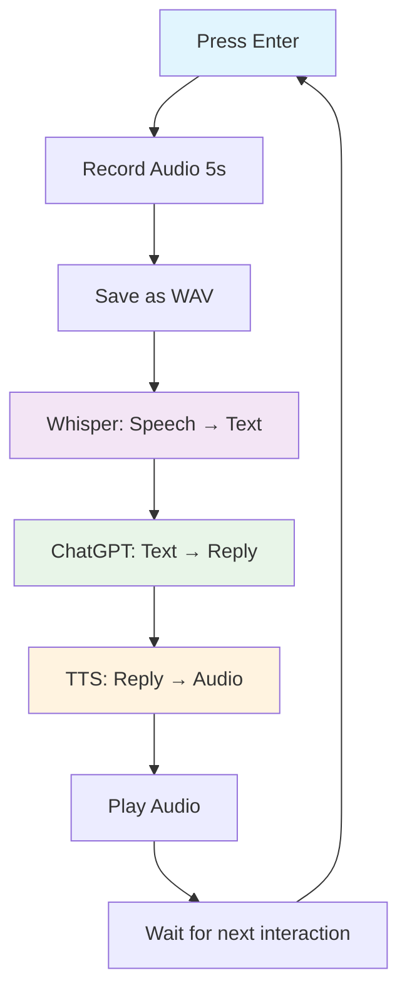

# Voice Agent Flow Documentation

A detailed breakdown of how the voice agent processes audio through multiple AI services.

## 🔄 Step 0: Loop Waits for Input

**Function**: `await agent.conversation_loop()`

This function starts a loop that:

- Waits for you to press Enter (or type "exit")
- Starts recording for 5 seconds

**📍 Code:**

```python
user_choice = input("Press Enter to start recording (or type 'exit' to quit): ")
```

---

## 🎙️ Step 1: Audio Recording (5 seconds)

**Function**: `self.recorder.record_audio(duration=5)`

When you press Enter:

- PyAudio opens the microphone
- It reads short chunks of data in a loop and stores them in `self.frames`
- After 5 seconds, the recording is stopped

**📍 Code:**

```python
for _ in range(0, int(self.sample_rate / self.chunk_size * duration)):
    data = self.stream.read(self.chunk_size)
    self.frames.append(data)
```

---

## 💾 Step 2: Audio Saved to Temporary File

**Function**: `self.recorder.save_audio(temp_filename)`

- It writes `self.frames` (list of audio chunks) to a `.wav` file
- Used for sending to OpenAI Whisper

---

## 🧠 Step 3: Speech Transcribed by Whisper (STT)

**Function**: `text_content = await self.audio_to_text.get_text_content(audio_content)`

- Converts `.wav` to `AudioContent` object
- Sends it to OpenAI Whisper model (`whisper-1`)
- Whisper returns the text you spoke

**📍 Code:**

```python
audio_content = AudioContent.from_audio_file(temp_filename)
text_content = await self.audio_to_text.get_text_content(audio_content)
```

**✅ Result**: Now we have your input as text (e.g., "What's the weather today?")

---

## 💬 Step 4: Text Sent to GPT (Chat Completion)

**Function**: `response = await self.chat_service.get_chat_message_content(...)`

- Your transcribed text is added to the conversation `ChatHistory`
- A chat completion request is sent to GPT (`gpt-4o-mini`)
- The model generates a response (e.g., "It's sunny and 28°C today.")
- Response is added to the chat history

**📍 Code:**

```python
self.history.add_user_message(user_input)
response = await self.chat_service.get_chat_message_content(...)
self.history.add_assistant_message(response.content)
```

**✅ Result**: Now we have the assistant's reply text.

---

## 🔊 Step 5: GPT Reply Sent to TTS (Text-to-Speech)

**Function**: `audio_content = await self.text_to_audio.get_audio_content(text, ...)`

- GPT response is sent to OpenAI TTS model (`tts-1`)
- TTS returns audio content (e.g., WAV data of the assistant saying: "It's sunny and 28°C today.")

**📍 Code:**

```python
audio_content = await self.text_to_audio.get_audio_content(
    text,
    OpenAITextToAudioExecutionSettings(response_format="wav")
)
```

**✅ Result**: We now have audio data ready to play.

---

## ▶️ Step 6: Audio Played Back to User

**Function**: `self.player.play_audio(audio_content.data)`

- Uses PyAudio to open a speaker stream
- Plays the audio data returned by TTS

**📍 Code:**

```python
stream.write(audio_data)
```

**✅ You now hear the assistant reply out loud.**

---

## 🔁 Step 7: Back to the Loop

Once playback is done, it goes back to waiting for the next Enter key press. You can:

- Speak again
- Say "exit" to quit

---

## 📊 Flow Summary



## 🔧 Technical Details

### AI Models Used:

- **Whisper-1**: Speech-to-Text conversion
- **GPT-4o-mini**: Natural language processing and response generation
- **TTS-1**: Text-to-Speech conversion

### Audio Processing:

- **Sample Rate**: 16,000 Hz
- **Channels**: 1 (mono)
- **Format**: WAV
- **Duration**: 5 seconds per recording

### Error Handling:

- Temporary file cleanup after processing
- Graceful error messages for failed transcription
- Fallback to text output if audio playback fails
